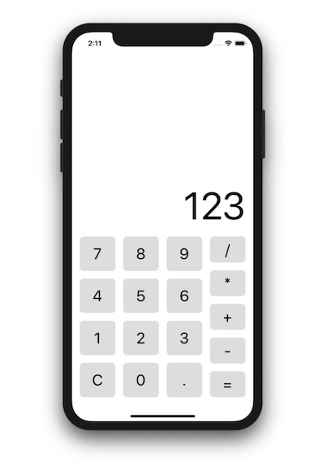

# CalculatorApp
React Native Calculator App, using Expo v35, react v16.9.0, redux 4.0.4 and react-redux v7.1.3

This app runs on Expo v35.0.0, react native v0.59 (I guess).



Setup Expo:
```
https://docs.expo.io/versions/v35.0.0/get-started/installation/
```
Setup project:
```
git clone https://github.com/datvp09/CalculatorApp.git

cd CalculatorApp && npm install

expo start
```
To test app using Jest run:
```
npm run test
```
